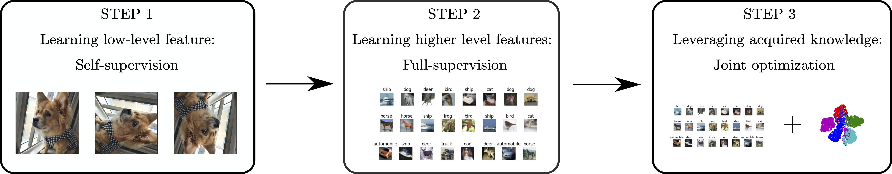

# AutoNovel

**[Automatically Discovering and Learning New Visual Categories with Ranking Statistics, ICLR 2020](http://www.robots.ox.ac.uk/~vgg/research/auto_novel/)**,
<br>
[Kai Han*](http://www.hankai.org), [Sylvestre-Alvise Rebuffi*](http://www.robots.ox.ac.uk/~srebuffi/), [Sebastien Ehrhardt*](), [Andrea Vedaldi](http://www.robots.ox.ac.uk/~vedaldi/), [Andrew Zisserman](http://www.robots.ox.ac.uk/~az/)
<br>




## Dependencies

All dependencies are included in `environment.yml`. To install, run

```shell
conda env create -f environment.yml
```

(Make sure you have installed [Anaconda](https://www.anaconda.com/) before running.)

Then, activate the installed environment by

```
conda activate auto_novel
```

## Overview

We provide code and models for our experiments on CIFAR10, CIFAR100, SVHN, OmniGlot, and ImageNet:

- Code for self-supervised learning
- Code for supervised learning
- Code for novel category discovery
- Our trained models and all other required pretrained models

## Data preparation

By default, we put the datasets in `./data/datasets/` and save trained models in `./data/experiments/` (soft link is suggested). You may also use any other directories you like by setting the `--dataset_root` argument to `/your/data/path/`, and the `--exp_root` argument to `/your/experiment/path/` when running all experiments below.

- For CIFAR-10, CIFAR-100, and SVHN, simply download the datasets and put into `./data/datasets/`.

- For OmniGlot, after downloading, you need to put `Alphabet_of_the_Magi, Japanese_(katakana), Latin, Cyrillic, Grantha` from  `imags_background` folder into `images_background_val` folder, and put the rest alphabets into `images_background_train` folder.

- For ImageNet, we provide the exact split files used in the experiments following existing work. To download the split files, run the command:
  ``
  sh scripts/download_imagenet_splits.sh
  ``
  . The ImageNet dataset folder is organized in the following way:

    ```
  ImageNet/imagenet_rand118 #downloaded by the above command
  ImageNet/images/train #standard ImageNet training split
  ImageNet/images/val #standard ImageNet validation split
    ```

## Pretrained models and datasets

We provide our trained models and all other required pretrained models. To download, run:

```
sh scripts/download_pretrained_models_dataset.sh
```

After downloading, you may directly jump to Step 3 below, if you only want to run our ranking based method.

## Step 1: Self-supervised learning with both labelled and unlabelled data

```
CUDA_VISIBLE_DEVICES=0 python selfsupervised_learning.py --dataset_name cifar10 --model_name rotnet_cifar10 --dataset_root ./data/datasets/CIFAR/
```

``--dataset_name`` can be one of ``{cifar10, cifar100, svhn}``; ``--dataset_root`` is set to ``./data/datasets/CIFAR/`` for CIFAR10/CIFAR100 and ``./data/datasets/SVHN/`` for SVHN.

Our code for step 1 is based on the official code of the [RotNet paper](https://arxiv.org/pdf/1803.07728.pdf).

## Step 2: Supervised learning with labelled data

```
# For CIFAR10
CUDA_VISIBLE_DEVICES=0 python supervised_learning.py --dataset_name cifar10 --model_name resnet_rotnet_cifar10

# For CIFAR100
CUDA_VISIBLE_DEVICES=0 python supervised_learning.py --dataset_name cifar100 --model_name resnet_rotnet_cifar100 --num_labeled_classes 80 --num_unlabeled_classes 20

# For SVHN 
CUDA_VISIBLE_DEVICES=0 python supervised_learning.py --dataset_name svhn --model_name resnet_rotnet_svhn --dataset_root ./data/datasets/SVHN/
```

## Step 3: Joint training for novel category discovery

### Novel category discovery on CIFAR10/CIFAR100/SVHN

```shell
# Train on CIFAR10
CUDA_VISIBLE_DEVICES=0 sh scripts/auto_novel_cifar10.sh ./data/datasets/CIFAR/ ./data/experiments/ ./data/experiments/pretrained/supervised_learning/resnet_rotnet_cifar10.pth

# Train on CIFAR100
CUDA_VISIBLE_DEVICES=0 sh scripts/auto_novel_cifar100.sh ./data/datasets/CIFAR/ ./data/experiments/ ./data/experiments/pretrained/supervised_learning/resnet_rotnet_cifar100.pth

# Train on SVHN
CUDA_VISIBLE_DEVICES=0 sh scripts/auto_novel_svhn.sh ./data/datasets/SVHN/ ./data/experiments/ ./data/experiments/pretrained/supervised_learning/resnet_rotnet_svhn.pth
```

To train in the Incremental Learning (IL) mode, replace ``auto_novel_{cifar10, cifar100, svhn}.sh`` in the above commands by ``auto_novel_IL_{cifar10, cifar100, svhn}.sh``.

### Novel category discovery on OmniGlot

```shell
# For OmniGlot
CUDA_VISIBLE_DEVICES=0 python auto_novel_omniglot.py 
```

### Novel category discovery on ImageNet

```shell
# For ImageNet subset A
CUDA_VISIBLE_DEVICES=0 python auto_novel_imagenet.py --unlabeled_subset A

# For ImageNet subset B
CUDA_VISIBLE_DEVICES=0 python auto_novel_imagenet.py --unlabeled_subset B

# For ImageNet subset C
CUDA_VISIBLE_DEVICES=0 python auto_novel_imagenet.py --unlabeled_subset C
```

### Evaluation on novel category discovery

To run our code in evaluation mode, set the `--mode` to `test`. 

```shell
# For CIFAR10
CUDA_VISIBLE_DEVICES=0 python auto_novel.py --mode test --dataset_name cifar10 --model_name resnet_cifar10 --exp_root ./data/experiments/pretrained/

# For CIFAR100
CUDA_VISIBLE_DEVICES=0 python auto_novel.py --mode test --dataset_name cifar100 --model_name resnet_cifar100 --exp_root ./data/experiments/pretrained/ --num_labeled_classes 80 --num_unlabeled_classes 20 

# For SVHN
CUDA_VISIBLE_DEVICES=0 python auto_novel.py --mode test --dataset_name svhn --model_name resnet_svhn --exp_root ./data/experiments/pretrained/ --dataset_root ./data/datasets/SVHN

# For OmniGlot
CUDA_VISIBLE_DEVICES=0 python auto_novel_omniglot.py --mode test --model_name vgg6_seed_0 --exp_root ./data/experiments/pretrained/

# For ImageNet subset A
CUDA_VISIBLE_DEVICES=0 python auto_novel_imagenet.py --mode test --unlabeled_subset A --exp_root ./data/experiments/pretrained/

# For ImageNet subset B
CUDA_VISIBLE_DEVICES=0 python auto_novel_imagenet.py --mode test --unlabeled_subset B --exp_root ./data/experiments/pretrained/

# For ImageNet subset C
CUDA_VISIBLE_DEVICES=0 python auto_novel_imagenet.py --mode test --unlabeled_subset C --exp_root ./data/experiments/pretrained/
```

To perform the evaluation in the Incremental Learning (IL) mode, add in the above commands the argument ``--IL`` and replace the model name``resnet_{cifar10, cifar100, svhn}`` by ``resnet_IL_{cifar10, cifar100, svhn}``.

## Citation

If this work is helpful for your research, please cite our paper.

```
@inproceedings{Han2020automatically,
author    = {Kai Han and Sylvestre-Alvise Rebuffi and Sebastien Ehrhardt and Andrea Vedaldi and Andrew Zisserman},
title     = {Automatically Discovering and Learning New Visual Categories with Ranking Statistics},
booktitle = {International Conference on Learning Representations (ICLR)},
year      = {2020}
}
```

## Acknowledgments

This work is supported by the [EPSRC Programme Grant Seebibyte EP/M013774/1](http://seebibyte.org/), [Mathworks/DTA DFR02620](), and [ERC IDIU-638009](https://cordis.europa.eu/project/rcn/196773/factsheet/en).

****

# Experiments performed on AutoNovel

## Experiment 1 (Loss terms ablation study)

1. Open ``Autonovel.py`` file
2. Search for the 5 different loss terms and comment one of these to make sure that total loss term does not rely on this term
3. Run the ``autonovel-step`` without that loss term using the pre-trained weights of the ``supervised_learning-step``
4. Repeat the procedure 5 times to see the impact of each loss term on the model

## Experiment 2 (Change Topk experiment)

1. Open ``scripts/auto_novel_IL_cifar10.sh``
2. Change the ``topk`` parameters and train the model with the topk that you want
3. Repeat this procedure multiple times to see the impact of different ``topk`` values


## Experiment 3 (Remove SSL)

1. Open ``supervised_learning.py`` file.

2. Comment lines 301-310 

  ```python
      model.load_state_dict(state_dict, strict=False)
      for name, param in model.named_parameters():
          # If the parameter under analysis does not belong to 'head' (one of the two heads) or to 'layer4' (features
          # layer before the two heads), then freeze that parameter. In this way we are ensuring that all the parameters
          # will be frozen except for the two heads and the features layer, which we want to train.
          if 'head' not in name and 'layer4' not in name:
              param.requires_grad = False 
  ```

3. Run ``supervised_learning.py`` 

4. Run ``autonovel.py`` 


## Experiment 4 (Using different SSL techniques)

Here we are trying different SSL methods taken by the SSL-library [solo-learn](https://github.com/vturrisi/solo-learn). We start by loading the weights of different methods, these weights are used as SSL weights (avoiding step 1). At this point we move on with the training directly from step 2 and step 3.

1. Run the following command to download the weights

```bash
sh scripts/load_SSL_weights.sh
```

2. Open ``supervised_learning.py`` and you will find the following SSL method (Barlow_twins, simsiam, supcon, swav, vibcreg, vicreg, wmse)
3. There are 2 flags called ``New_SSL_methods`` and ``New_Resnet_config`` at line 229, 230. 
   - ``New_SSL_methods`` : When you set it to true you are allowed to work other SSL methods other than rotnet. Setting it to false automatically indicate that you are running with rotnet.
   - ``New_Resnet_config`` : This flag is used to indicate if you use the Autonovel Resnet or Resnet architecture similar to solo learn. There is a small difference in the performance between these two. When you load any of the Sololearn methods, we automatically use the similar Resnet architecture. When we are using rotnet, we leave it to the user to decide what to do. Setting to False means that we are using the Autonovel Resnet architecture.
4. Set variable called ``ssl``  in line 237 to one of these keys (Barlow_twins, simsiam, supcon, swav, vibcreg, vicreg, wmse) to indicate what method of SSL to use.
5. Re train Supervised learning step using the command mentioned above.
6. Re train Auto novel learning step using the command mentioned above.

## Experiment 5 (Domain Shift)

### Cifar-10 with domain shift experiment

<span style="color:blue">**Jaccopo missing in here remove me when you are done jaccopo**</span>

### Mnist with domain shift experiment

1. The dataset will be automatically downloaded by running the code. The main problem in here is that you need to retrain the 3 steps to be able to work with these stuff. You can download our weights using script called ``download_mnisit_weights.sh``. Use this command to download the weights

   ```bash
   sh scripts/download_mnisit_weights.sh
   ```

2. Passing the dataset_name should be enought to allow you to use the Mnist or Mnisit mixed dataset

   - Passing ``mnisit`` leads to load the mnist dataset containing the first 5 classes from the normal mnist and the second 5 classes from the mnist-m dataset.
   - Passing ``mnisit_base`` lead to loading the full mnist dataset containing all the 10 classes. This can be used as baseline. 

3. you are able to to run the three steps using this code. 

To run the first 2 steps use the normal commands mentioned previously .

To train Step 3 use this command

```bash
# Train on mnist_base
CUDA_VISIBLE_DEVICES=0 sh scripts/autonovel_IL_mnisit_mix.sh ./data/datasets/MNISIT/ ./data/experiments/ ./data/experiments/supervised_learning/resnet_rotnet_mnisit_baseline.pth resnet_IL_minsiit_baseline mnisit_baseline
# Train on mnist
CUDA_VISIBLE_DEVICES=0 sh scripts/autonovel_IL_mnisit_mix.sh ./data/datasets/MNISIT/ ./data/experiments/ ./data/experiments/supervised_learning/resnet_rotnet_mnisit_MIX.pth resnet_IL_minst_mix mnisit
```

To evaluate use this command

```bash
# for mnist
CUDA_VISIBLE_DEVICES=0 python auto_novel.py --mode test --dataset_name mnisit --model_name resnet_IL_minst_mix --exp_root ./data/experiments/pretrained/
# for mnist Base
CUDA_VISIBLE_DEVICES=0 python auto_novel.py --mode test --dataset_name mnisit_baseline --model_name resnet_IL_minsiit_baseline --exp_root ./data/experiments/pretrained/
```


## Experiment  6 (Unbalanced Classes) - Supported only for CIFAR-10
This experiment allows to train and test a model using a custom number of samples for each class of CIFAR10.

We performed this experiment to see how the model performs in the case where the number of labeled samples is very low (1/10 of the unlabeled samples), and in the opposite case, where the number of unlabeled samples is equal to 1/10 of the labeled samples.

The experiment is based on a custom version of the CIFAR10 dataset called CustomCIFAR10. This takes in input all the usual parameters of the CIFAR10 dataset and a ``remove_dict``. This parameters allow to give in input a dictionary, which specifies how many samples we want to be removed for each class. The dictionary need to follow this format: ``remove_dict={0: 0, 1: 0, 2: 0, 3: 0, 4: 0, 5: 4500, 6: 4500, 7: 4500, 8: 4500, 9: 4500}``. In this previous example we are removing 0 samples for each class from 0 to 4, while we are removing 4500 samples for each class from 5 to 9. The specified number of samples to remove is removed randomly between the samples of the specified class.

To run your own unbalanced experiment, follow the ensuing procedure:

1. Train your model until the end of the ``selfsupervised_learning-step`` and store the weights of your model (refer to the first part of the ``readme`` file for the full procedure to follow for SSL training)

2. Open the file ``unbalanced_supervised_learning.py``
   - At line 191 turn ``logging_on`` to True if you need to log the data to WandB, otherwise check it to be False
   - At line 224 turn ``New_SSL_methods`` to True if you have used a different SSL techinque (see Experiment 1), in that case, specify at line 235 which model you want to load. Otherwise check it to be False
   - At line 310 verify that ``unbalanced`` is set to True to use the unbalanced version of CustomCIFAR10
   - At line 312 define your own ``remove_dict`` that will be applied to CustomCIFAR10

3. From cmd run the following line of code to perform the supervised_learning (change the parameters ``name_of_your_input_model`` and ``name_of_your_output_model``):
   ```shell
      CUDA_VISIBLE_DEVICES=0 python unbalanced_supervised_learning.py --ssl_weights_dir ./data/experiments/...../name_of_your_input_model.pth --model_name  name_of_your_output_model --new_resnet
   ```
   The flag ``new_resnet`` is used to turn on its respective option
      - Do not use the flag ``--new_resnet`` if your model has been trained using the ResNet defined by the AutoNovel authors. Use that flag if your model has been trained using a standard ResNet (as from ResNet original paper)

4. Your trained model weights will be stored in ``data/experiments/unbalanced_supervised_learning/name_of_your_output_model.pth``

5. Once the ``unbalanced_supervised_learning-step`` is finished, open the file ``unabalanced_auto_novel.py``
   - At line 410 turn ``logging_on`` to True if you need to log the data to WandB, otherwise check it to be False
   - At line 430 turn ``New_Resnet`` to True if you used a standard ResNet, check it to be False if you used the ResNet defined by the authors
   - At line 486 turn ``unbalanced`` to True to use the unbalanced version of CustomCIFAR10
   - At line 488 define your own ``remove_dict`` that will be applied to CustomCIFAR10

6. Depending on the Incremental-Learning (IL) setting that you want to use to train your model:
   - If IL enabled -> run ``auto_novel_IL_cifar10_unbalanced.sh`` through cmd using the following line of code (change the parameters ``name_of_your_input_model`` and ``name_of_your_output_model``):
   ```shell
      CUDA_VISIBLE_DEVICES=0 sh scripts/auto_novel_IL_cifar10_unbalanced.sh ./data/experiments/...../name_of_your_input_model.pth name_of_your_output_model
   ```

   - If IL disabled -> run ``auto_novel_cifar10_unbalanced`` through cmd using the following line of code change the parameters ``name_of_your_input_model`` and ``name_of_your_output_model``):
   ```shell
      CUDA_VISIBLE_DEVICES=0 sh scripts/auto_novel_cifar10_unbalanced.sh ./data/experiments/...../name_of_your_input_model.pth name_of_your_output_model
   ```

7. Your trained model weights will be stored in ``data/experiments/unbalanced_auto_novel/name_of_your_output_model.pth``

## Experiment 7 (Different number of unlabeled/labeled classes)
NOEMI STUFF

## Plotting t-SNE for any experiment 
The t-distributed Stochastic Neighbor Embedding is a statistical tool that allows to represent high dimensional samples into a low dimensional space relying on a statistical algorithm. Due to its stochastic nature this algorithm leads to different output for each run, also if the input data and the used parameters are exactly the same.

We used the t-SNE plots to show how much the features learned by our models are effective. They allow us to see how the samples belonging to different categories are clustered. Ideally, we would like to see compact cluster well distatiented between them. This condition would point that our model learnt some good features which allows to distinguish between samples coming from different classes in an efficient way.

To plot the t-SNE for your model follow the ensuing procedure (steps using CIFAR-10 as dataset):

1. Train your model until the end of the ``AutoNovel-step`` and store the weights of your model

2. Put the weights of your model into the path ``data/experiments/auto_novel_tSNE_plot/name_of_your_input_model.pth``

3. To start the generation of the t-SNE plots you will need to use the following command line from cmd (change the parameter ``name_of_your_input_model`` with the name of the model weights that you want to load from ``data/experiments/auto_novel_tSNE_plot``):
   ```shell
   CUDA_VISIBLE_DEVICES=0 python auto_novel_tSNE_plot.py --input_model_name name_of_your_input_model --new_resnet --IL 
   ```
   The two flags (``--new_resnet`` and ``--IL``) are used to turn on the respective options
      - Do not use the flag ``--new_resnet`` if your model has been trained using the ResNet defined by the AutoNovel authors. Use that flag if your model has been trained using a standard ResNet (as from ResNet original paper)
      - Use the flag ``--IL`` if your model has been trained in the ``AutoNovel-step`` using Incremental-Learning, otherwise, do not use this flag

4. The produced plots will be stored in the folder ``tSNE_plots/name_of_you_model``

5. If you are working on a dataset different from CIFAR-10, or if other changes have been applied on the training procedure, then apply the due changes also to the py file ``auto_novel_tSNE_plot.py``
